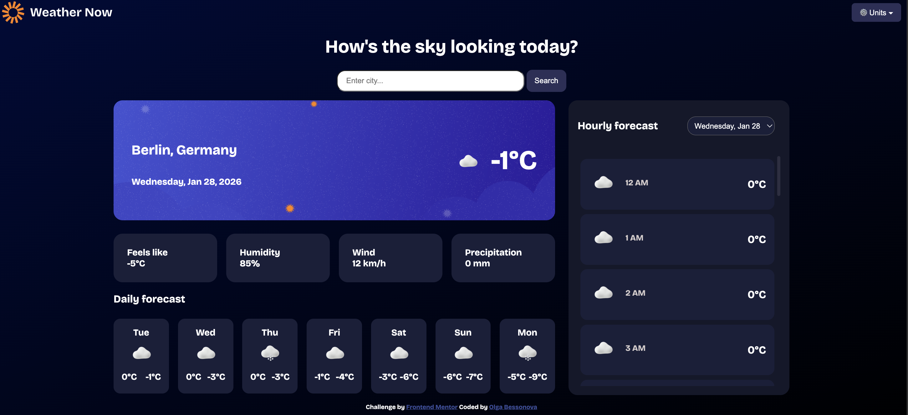

[Live Site URL](https://olga-bessonova.github.io/weather-app/)

## Table of contents

- [Overview](#overview)
  - [The challenge](#the-challenge)
  - [Screenshot](#screenshot)
  - [Links](#links)
  - [Built with](#built-with)

- [Author](#author)

## Overview
This is a solution to the [Weather app challenge on Frontend Mentor](https://www.frontendmentor.io/challenges/weather-app-K1FhddVm49).

### The challenge

Users should be able to:

- Search for weather information by entering a exact city name in the search bar
- View current weather conditions including temperature, weather icon, and location details
- See additional weather metrics like "feels like" temperature, humidity percentage, wind speed, and precipitation amounts
- Browse a 7-day weather forecast with daily high/low temperatures and weather icons
- View an hourly forecast showing temperature changes throughout the day
- Switch between different days of the week using the day selector in the hourly forecast section
- Toggle between Imperial and Metric measurement units via the units dropdown 
- Switch between specific temperature units (Celsius and Fahrenheit) and measurement units for wind speed (km/h and mph) and precipitation (millimeters) via the units dropdown
- View the optimal layout for the interface depending on their device's screen size
- See hover and focus states for all interactive elements on the page

### Screenshot

### Links

[Live Site URL](https://olga-bessonova.github.io/weather-app/)

### Built with

- HTML
- CSS custom properties
- Javascript

## Author

- Website - [Olga Bessonova](https://olgabessonova.com/)
- [@LinkedIn](https://www.linkedin.com/in/olgabessonova-/)
